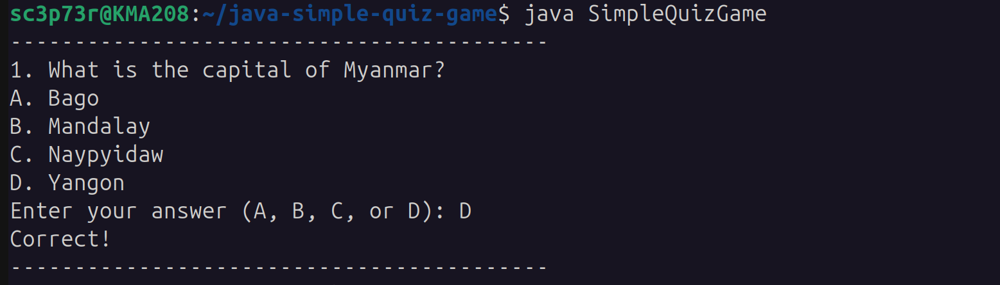
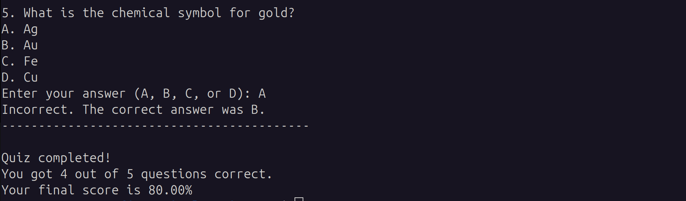

# Java Simple Quiz Game Program

## Step 1: Install the JDK
To istall OpenJDK 17, use this command on Linux:

```
sudo apt install openjdk-17-jdk
```

## Step 2: Verify the Installation
After the installation is complete, you can verify that both the java runtime and the javac compiler are correctly installed.a
Check the Java runtime version:

```
java --version
```
Check the Java compiler version:

```
javac --version
```
## Step 3: Create Simple Quize Game Program
- Save the file: Make sure the code is saved in a file name 'SimpleQuizGame.java'
- Compile the code: Navigate to the directory where you saved the file and use the Java compiler (javac) to compile it into bytecode.

```
javac SimpleQuizGame.java
```
If there are no errors, this command will create a new file named 'SimpleQuizGame.class' in the same directory.

- Run the program: Now, you can run the compiled program using the Java Virtual Machine (java).

```
java SimpleQuizGame
```
The program will then execute in your terminal, and you can begin the quiz.

## Application Dir Structure


## Output
Question 1:


Question 2:


Question 3:


Question 4:


Question 5:


## Updated Dockerfile
```
FROM openjdk:17-slim
WORKDIR /app
COPY . .
CMD ["java", "SimpleQuizGame"]

```

## Build Dockerfile (Manual Build)
```
docker build -t simple-quiz-game-java:latest .
```

## Pull Docker Image (Ready To Use)
```
docker pull sc3p73r/simple-quiz-game-java:latest
```

## Running the Docker Container
```
docker run -it --name java-app simple-quiz-game-java:latest
```